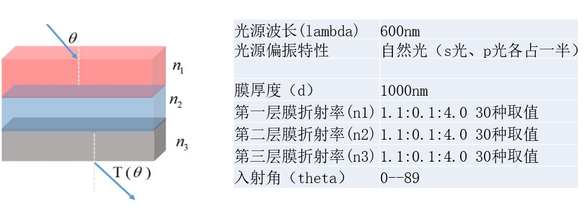

# 基于深度学习的多层薄膜透反射谱的预测以及逆向
这是以前的一个项目，最近整理出来留作备份

# 文件结构

## 数据生成
creat_data.py 是一个手写的薄膜仿真文件，能够相比于comsol以及fdtd等商业软件更快的生成数据。  
算法参考物理光学梁栓延中的透反射那一章（忘了哪一页了……）  
能够自定义设置层厚度，波长，入射角度的抽样点数，层的个数以及仿真的个数。

以后可能会更新自定义每一层各自的厚度等功能。

## 网络模型
这个暂时没找到……当初用的keras写的，模型和算法文件丢失了……  
网络结构是一个很简单的类自编码器结构。
>参考文献：D. Liu, Y. Tan, E. Khoram, and Z. Yu, “Training deep neural networks for the inverse design of nanophotonicstructures,” arXiv e-prints arXiv:1710.04724 (2017).

以后看需求，会用torch重写补上。